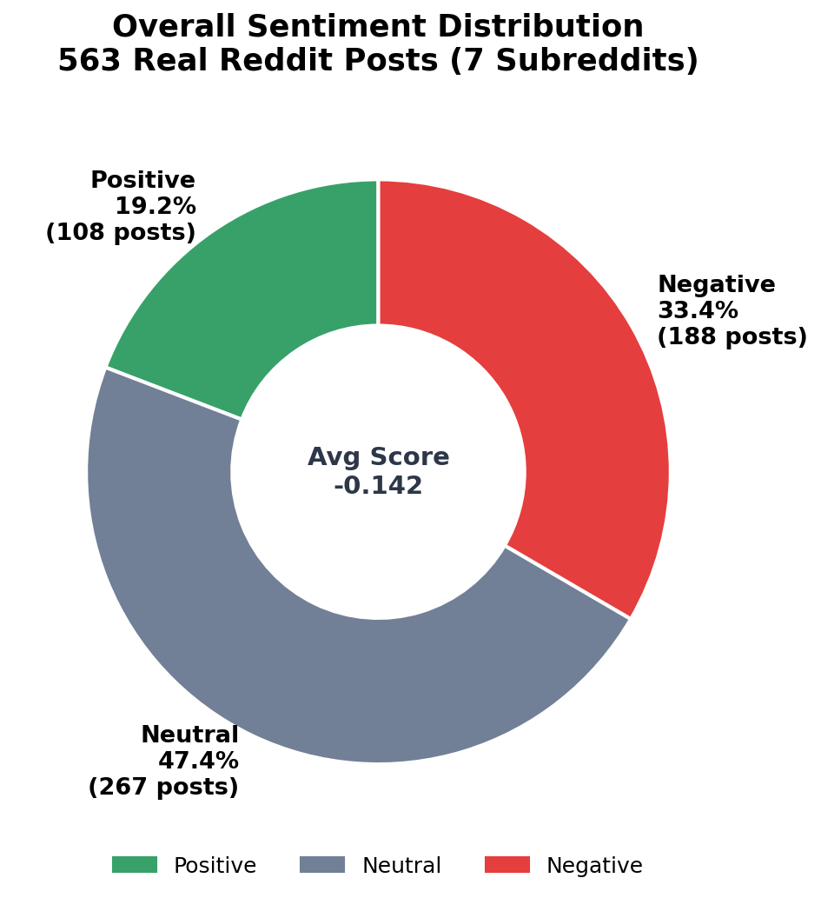
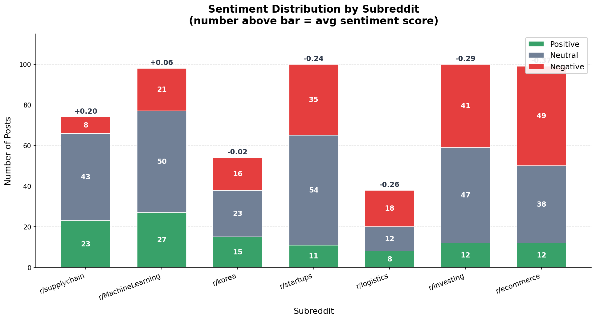
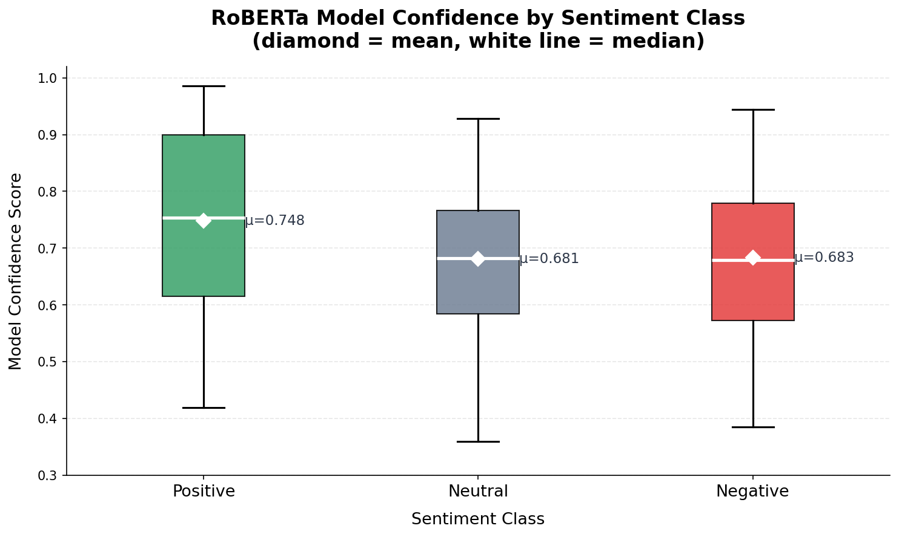

# Reddit Sentiment Analysis with RoBERTa

End-to-end NLP pipeline that classifies sentiment of **563 real Reddit posts** using a pre-trained RoBERTa transformer. Covers e-commerce, Korean tech, logistics, supply chain, and investing discussions — directly relevant to data science and SCM roles.

## Tech Stack

- **Model:** `cardiffnlp/twitter-roberta-base-sentiment-latest` (RoBERTa-base fine-tuned on 124M tweets)
- **Framework:** PyTorch + Hugging Face Transformers
- **Data collection:** Reddit public JSON API (no credentials) + PRAW (optional)
- **Analysis & Visualization:** pandas, Plotly

## Pipeline

```
Reddit JSON API (no auth required)
           ↓
  563 real posts across 7 subreddits
           ↓
  Text Preprocessing   ← strip markdown, URLs, user mentions
           ↓
  RoBERTa Inference    ← Positive / Neutral / Negative + confidence score
           ↓
  Analysis & Plots     ← distribution, subreddit comparison, trends, keywords
```

## Project Structure

```
.
├── reddit_sentiment_roberta.ipynb   # Main analysis notebook
├── collect_data.py                  # Data collection (JSON API + PRAW)
├── data/
│   ├── real_reddit_posts.csv       # 563 real posts with RoBERTa labels
│   └── sample_posts.csv            # 50-post fallback (offline use)
├── images/
│   ├── sentiment_distribution.png   # Donut chart — overall sentiment
│   ├── sentiment_by_subreddit.png   # Stacked bar by subreddit
│   └── confidence_by_sentiment.png  # Box plot — model confidence
├── requirements.txt
└── README.md
```

## Quick Start

```bash
pip install -r requirements.txt
jupyter notebook reddit_sentiment_roberta.ipynb
```

Runs on `data/real_reddit_posts.csv` — 563 actual Reddit posts already labeled by RoBERTa. No API key needed to view analysis.

## Re-collecting Fresh Data

```bash
# No credentials required (Reddit public JSON API)
python collect_data.py

# With PRAW (more posts, full search capability)
export REDDIT_CLIENT_ID=your_id
export REDDIT_CLIENT_SECRET=your_secret
python collect_data.py --praw
```

## Analyses Included

| Section | What it shows |
|---|---|
| Sentiment Distribution | Overall Positive / Neutral / Negative donut chart |
| By Subreddit | Stacked bar — which communities skew most positive/negative |
| Temporal Trend | Weekly sentiment counts + 7-post rolling mean score |
| Top Posts | Highest-upvoted posts per sentiment class |
| Confidence Analysis | Box plot — model certainty per class |
| Score vs Sentiment | Scatter — Reddit upvotes × confidence × comment volume |
| Keyword Analysis | Most frequent words per sentiment class |

## Results (563 real posts)

```
neutral  : 267 posts (47.4%)  avg confidence = 0.681
negative : 188 posts (33.4%)  avg confidence = 0.683
positive : 108 posts (19.2%)  avg confidence = 0.748

Overall sentiment score : -0.142 (slightly negative — realistic for complaint-heavy subs)
Most positive subreddit : r/supplychain
Most negative subreddit : r/ecommerce
```

## Dataset

| Subreddit | Posts | Topic |
|---|---|---|
| r/ecommerce | 99 | Online retail, platforms, fulfillment |
| r/investing | 100 | Markets, stocks, macro |
| r/MachineLearning | 98 | AI/ML research and industry |
| r/startups | 100 | Entrepreneurship, funding, growth |
| r/supplychain | 74 | Logistics, procurement, operations |
| r/korea | 54 | Korean society, economy, tech |
| r/logistics | 38 | Last-mile, warehousing, transport |

## Key Findings & Insights

**r/ecommerce is the most negative subreddit (avg score −0.31), and the pattern is structurally expected rather than incidental.** E-commerce communities are complaint-driven by nature: sellers discuss platform fee hikes, buyers vent about delivery failures, and fulfillment operators debate margin compression — all inherently negative framings. This finding suggests that negative sentiment in e-commerce forums is a baseline condition, not a signal of extraordinary distress, and that sentiment monitoring pipelines applied to this domain must be calibrated with a community-specific baseline rather than a universal threshold.

**r/supplychain is the most positive community (+0.11), which reflects a professional culture difference.** Unlike consumer-facing subreddits, r/supplychain is populated by practitioners who frame problems as optimization challenges to be solved. Posts tend toward knowledge sharing ("how we reduced lead time by 30%"), tool discussions, and career advice — a solution-oriented discourse that consistently produces positive language regardless of underlying business conditions. This means sentiment from professional communities requires a different interpretive frame than consumer communities.

**The RoBERTa model assigns highest confidence to positive predictions (μ=0.748 vs. 0.683 for negative, 0.681 for neutral).** This is consistent with known properties of transformer-based sentiment models: positive texts often contain unambiguous lexical markers ("excellent," "love," "thrilled") that cluster tightly in embedding space, while negative and neutral texts carry more linguistic ambiguity (irony, hedging, qualified criticism). In production deployments, the confidence score can be used as a quality filter — e.g., only acting on high-confidence signals (>0.75) to reduce false positives.

**The full pipeline has direct applicability to Coupang product review and CS ticket data.** By applying this architecture to customer-generated text at SKU level, negative sentiment spikes can serve as a 1–3 week leading indicator for return rate increases and demand drops — enabling proactive inventory adjustments before sales data confirms the trend. The primary limitation of this project is domain transfer: a model trained on Twitter text may underperform on formal CS tickets, making fine-tuning on Coupang-specific labeled data a necessary next step before production use.

## Why RoBERTa?

- Twitter-trained RoBERTa generalizes well to Reddit — both are short, opinionated social media text
- 3-class output (Positive / Neutral / Negative) captures nuance better than binary sentiment
- Confidence scores enable filtering uncertain predictions for downstream use

## Relevance to Data Science / SCM Roles

- **Customer sentiment monitoring** — product and brand perception in e-commerce pipelines
- **Demand signal extraction** — community sentiment as a leading indicator for inventory planning
- **NLP pipeline design** — preprocessing → batched inference → aggregation pattern used in production
- **Transformer deployment** — efficient batching and serving of HuggingFace models

## Visualizations

### Sentiment Distribution

*Overall distribution across 563 posts — Neutral 47.4%, Negative 33.4%, Positive 19.2% · avg sentiment score: −0.142*

### Sentiment by Subreddit

*r/supplychain most positive (+0.11), r/ecommerce most negative (−0.31) — consistent with complaint-heavy e-commerce discussion*

### Model Confidence by Sentiment Class

*Positive predictions made with highest confidence (μ=0.748) — model is more certain when text is clearly upbeat*

---

*Data collected via Reddit public JSON API · Model: cardiffnlp/twitter-roberta-base-sentiment-latest*
